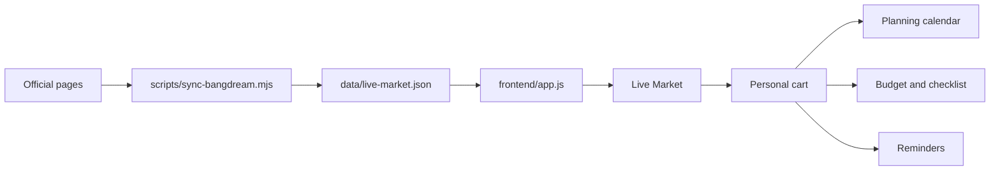

# LivePlan Architecture

LivePlan is currently a static frontend with a structured data layer and script scaffolding for future official-source sync.

```text
liveplan-app/
├─ index.html                 # Redirects to frontend/
├─ frontend/
│  ├─ index.html              # App shell and views
│  ├─ app.js                  # UI state, cart, planning, reminders
│  └─ styles.css              # Visual system
├─ data/
│  └─ live-market.json        # Structured official Live data
├─ scripts/
│  ├─ serve.ps1               # Local static server
│  └─ sync-bangdream.mjs      # Official-source fetch/check scaffold
└─ docs/
   └─ architecture.md
```

## Data Flow



## Current Boundaries

- `frontend/` owns the user experience only.
- `data/live-market.json` owns verified Live facts.
- `scripts/` will own fetching, checking, and eventually updating official data.
- Personal user data stays in browser `localStorage` for now.

## Next Data Step

The current sync script checks official source pages and writes a report to `data/source-checks.json`. The next milestone is to make it parse event fields into a staging file, then merge only verified fields into `data/live-market.json`.
